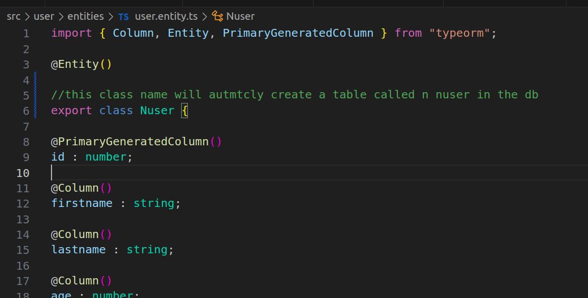

<p align="center">
  <a href="http://nestjs.com/" target="blank"></a>
</p>


## using Config Files and Database Connection of Postgres via TypeORM

check https://docs.nestjs.com/techniques/database


## Installation

```bash
npm install --save @nestjs/typeorm typeorm pg
```


Now create a db by query in the dbeaver or pgadmin

```
create database typeorm

```


make sure you keep this databasename in the import section of app module

one way is to connect db is via app.module 


other way is to make a config file and than connect

but firstly install
```
$ npm i --save @nestjs/config
```
## Creating Entities 

```bash
nest g res user
```

after that make a user role by clicking on the typeorm database and pressing ctrl + enter which will open a sql script in dbeaver than type:--
CREATE ROLE maheboob WITH LOGIN PASSWORD 'postgres123';

GRANT ALL PRIVILEGES ON ALL TABLES IN SCHEMA public TO maheboob;

after that change the username and password in the local.env file also 

* NOTE Do not user USERNAME as the variable name in .env file otherwise it will take the laptop username instead user DB_USERNAME


## User Entity (a DTO for DB used by repository(a pseudo db for backend that interacts with actual db))

in the user.entity.ts
//the class name defined in this will autmtcly create a table called n nuser in the db


create the Schema(DTO for DB)



THE userRepo will be using the class defined in user.entity.ts a Repostiry in service.ts


## User DTO (a DTO for backend usage to validate incoming request and processing))


first create-user.dto.ts

and add the suitable dto defination

and than in user service.ts
use this DTO by creating a constructor


Creating User POST call


GET call for FindAll method 


PATCH (updating) call ->
note put updatest the record if id mathces if not it will create a new record if its not exist


DELETE call for removing


by now we are using builtin Repository

but you can use custom repository( in which the database interaction is written)


https://docs.nestjs.com/recipes/mikroorm#using-custom-repositories


